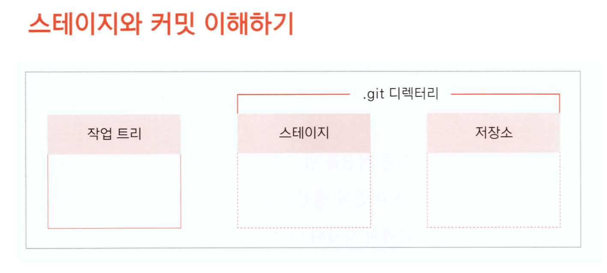
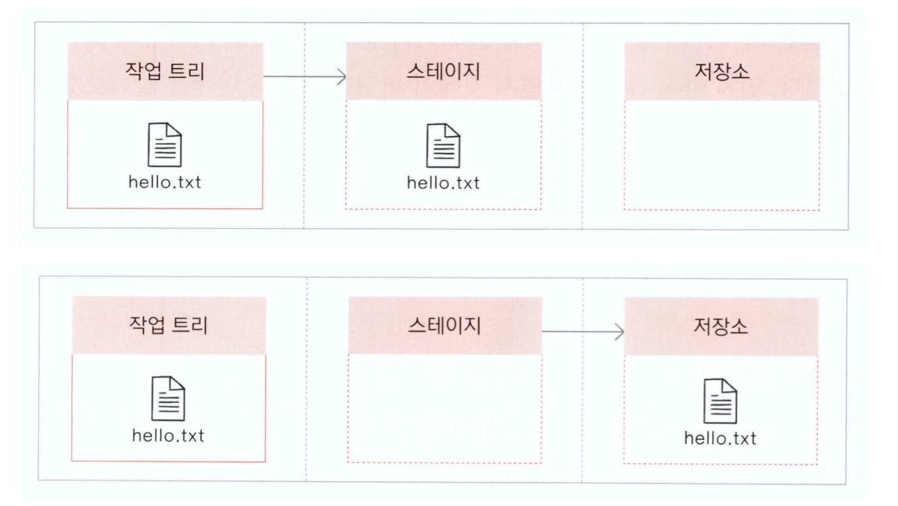
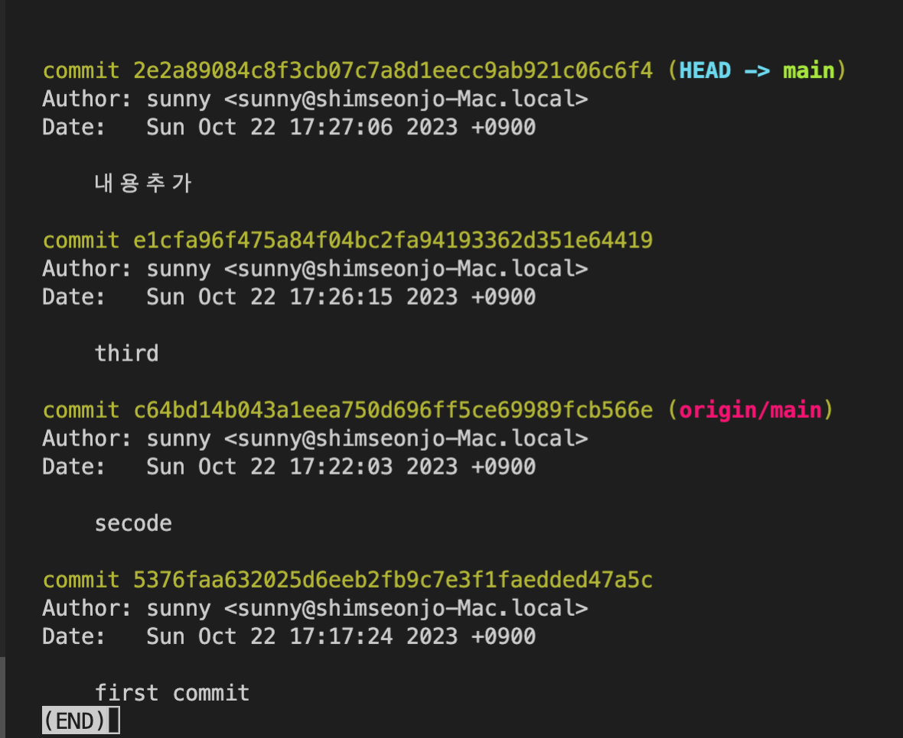
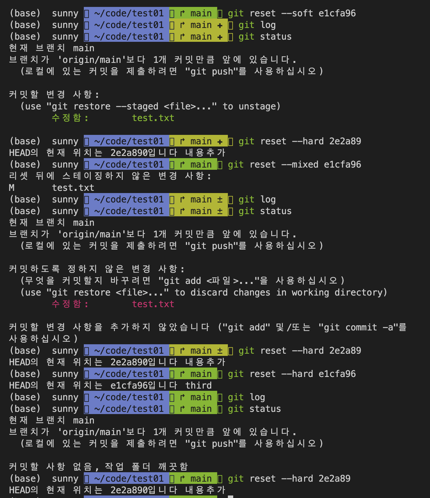
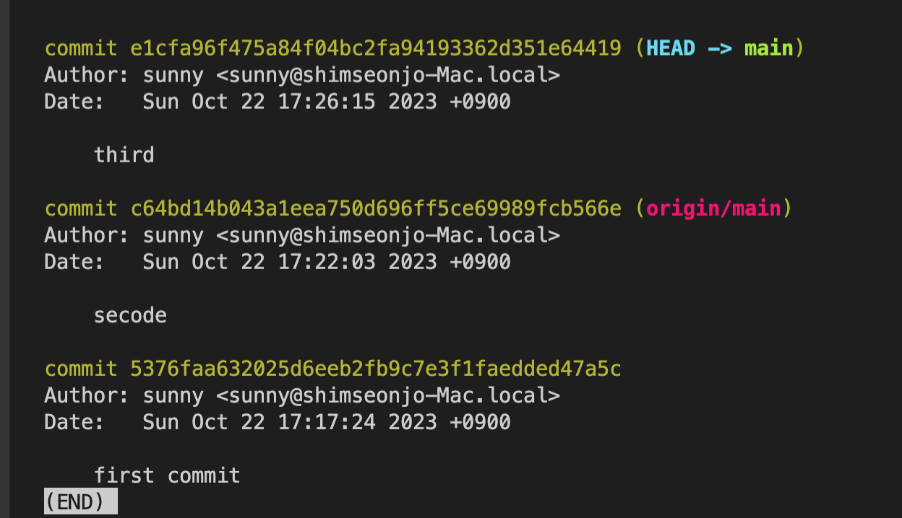
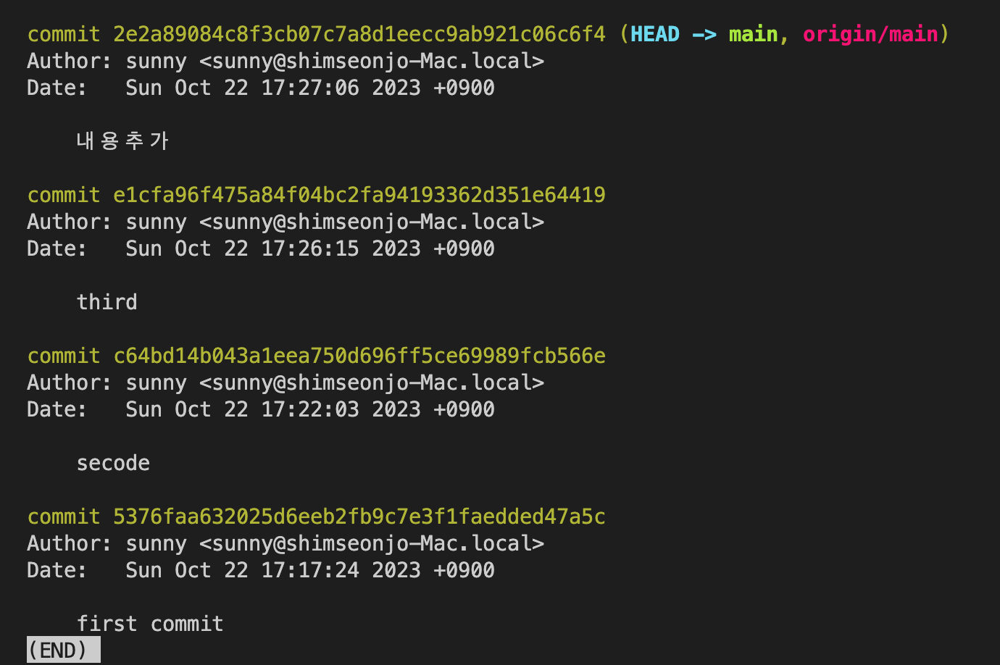
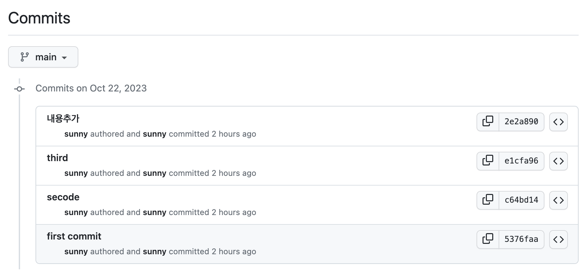
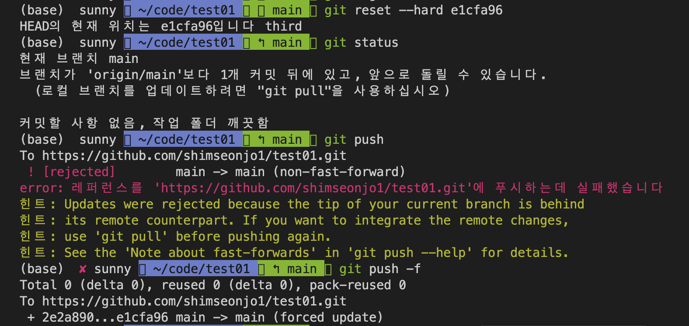
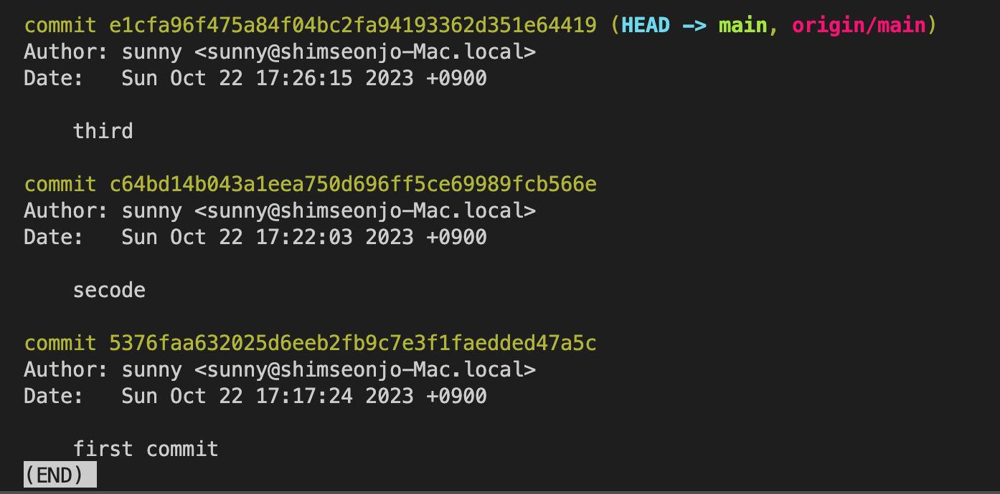

# git with GitHub

## 1. git 시작하기
- 다운로드 :  https://git-scm.com/downloads
> windows에서 GitHub에 한글 깨질때
> - cmd"명령프롬프트"> chcp 65001

## 2. github 회원가입
- 아이디,이메일 체크

## 3. git 작업순서



## 4. git 환경설정
```
# 설정정보 확인
git config --list

git config --global user.name <github-name>

git config --global user.email <github 등록 email>

```

## 5. 로컬 저장소 만들고 github를 리모트 저장소로 등록하기
```
cd <작업디렉토리>

git init

git add .

git commit -m "first commit"

# git-remote-url
# https://github.com/<사용자이름>/<저장소명>.git

git remote add origin <git-remote-url>

# -u 옵션은 처음 한번만 사용함
git push -u origin main

# 커밋 내역을 확인
git log

# git 상태 확인
git status
```

## 6. git clone - 이미 github 리파지토리가 있고, 내컴퓨터로 코드 전체 복사 할 경우
```
# 현재 위치에 리파지토리 이름의 폴더를 만들고 파일을 가져온다
git clone <git-remote-url>

# <디렉토리>위치에 파일을 가져온다.
git clone <git-remote-url> <디렉토리>
```


## 7. git pull - 내 컴퓨터로 github쪽 변경 내용만 내려받을 경우 
- github의 최신 변경내용을 내려 받고 수정 작업을 한다
```
git pull
# 파일 수정 작업 진행
git add .
git commit -m "커밋 메시지"
git push
```

## 8. reset
```
git log
git log --oneline
git reset --soft 커밋아이디
```
옵션  
--soft: 커밋을 취소하지만 스테이징 영역에는 그대로 남겨둡니다.  
워킹 디렉토리의 변경 사항은 그대로 유지됩니다.  
스테이징 영역의 변경 사항은 그대로 유지됩니다.  
커밋 기록은 변경되지 않습니다.  

--mixed: 커밋을 취소하고 스테이징 영역을 비웁니다.  
워킹 디렉토리의 변경 사항은 그대로 유지됩니다.  
스테이징 영역은 비워집니다.  
커밋 기록은 변경되지 않습니다.  

--hard: 커밋을 취소하고 스테이징 영역과 워킹 디렉토리를 모두 이전 상태로 되돌립니다.  
워킹 디렉토리의 변경 사항은 모두 삭제됩니다.  
스테이징 영역은 비워집니다.  
커밋 기록은 변경됩니다.  

### github push 이전에 되돌리기




### github push 이후에 되돌리기





## 9. revert
```
git revert [되돌리고 싶은 commit의 해시값 6자기까지]

# commit A -> commit B -> commit C 라면 
# 역순 commit C -> commit B -> commit A순으로 revert

# revert한 이력이 다 개별적으로 남은 위의 경우 3개의 커밋이 더 생성됨
# 이때 --no-commit 옵션을 주면 커밋은 하나만 생성되지만 명령어는 3번에 걸쳐 작성

# 한번에 명령으로 3단계를 취소하고 싶다면 HEAD~3
git revert --no-commit HEAD~3 #3단계를 취소함

# reverrt 후 commit하고 push하면 된다.
```

## 10. branch
```
# 브랜치 목록보기
git branch

# 브랜치 생성
git branch test01

# 브랜치 이동
git switch 브랜치명

# 브랜치 병합(main에서 작업해야함)
git merge 브랜치명

# 커밋 내용확인
git log --oneline --graph --all

# 브랜치 삭제
git branch -d 브랜치명

# 삭제후 복구
git branch 브랜치명 커밋값(ffa3169)

# 브랜치 충동 각각 다른 브랜치에서 같은 파일 편집
git merge -> 충돌내용 수정 후 -> 다시 add, commit
```

## 11. pr발행
